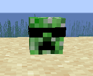

# Gravestone mod

[README](README.md) | [中文文档](README_zh.md)

这是一个使用 Fabric 编写的，仅需在服务端安装的墓碑 mod

支持 minecraft 1.16.x

CurseForge: https://www.curseforge.com/minecraft/mc-mods/gravestone

## 介绍

在安装该模组后死亡会留下一个外形为玩家头颅的墓碑，墓碑的外观为玩家的皮肤

玩家皮肤:

墓碑外观：

墓碑中会保存玩家身上的物品，若是物品上有消失诅咒的附魔，则玩家死亡后带有该附魔的物品会消失

玩家身上的经验值会除以 2 后放入墓碑中

在墓碑被破坏后墓碑中的物品和经验会掉落在地上

右键墓碑会显示死亡信息

## 安装

和常规 mod 一样只需要拷贝 gravestone mod 到 mods 目录下即可

该 mod 可以仅在服务端安装，客户端就算不安装该 mod 也能正常使用墓碑的功能，即原版客户端和未安装此 mod 的 fabric 客户端也能正常使用

## 感谢

感谢 [yet-another-gravestone-mod](https://github.com/Nuclearfarts/yet-another-gravestone-mod) 提供了实现墓碑的方案

感谢 [ServerAdditionsUtil](https://github.com/ExtraCrafTX/ServerAdditionsUtil) 提供了实现 server side mod 的方案